# ConvViTs

ConvViTs is a modular deep learning project focused on hybrid convolution-transformer architectures for computer vision.

The repository includes clean and extensible PyTorch implementations of:

- CvT ([Convolutional Vision Transformer](https://arxiv.org/abs/2103.15808)) — introduces convolutional token embedding and convolutional projections inside attention.
- CMT ([Convolutional Neural Networks Meet Vision Transformers](https://arxiv.org/abs/2107.06263)) — combines lightweight CNN inductive biases with transformer-based global reasoning.

The project is designed for experimentation, reproducibility, and research-oriented training workflows.

## Models
### Convolutional Vision Transformer (CvT)

CvT improves Vision Transformers by replacing standard linear projections with convolutional operations. This introduces spatial inductive bias while preserving transformer flexibility.

#### Main Ideas
- Convolutional token embedding
- Convolutional Q/K/V projections
- Hierarchical multi-stage transformer design
- Better efficiency on smaller datasets
<p align="center"> 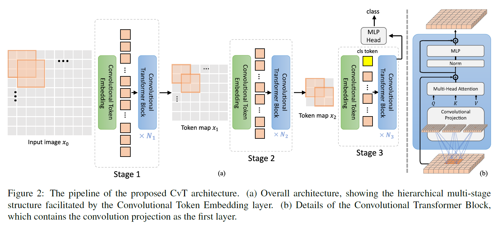 </p>

### CNNs Meet Vision Transformers (CMT)

CMT combines CNN locality with transformer global attention using lightweight modules.

#### Main Ideas
- Local Perception Units (LPU)
- Lightweight Multi-Head Self Attention (LMHSA)
- Inverted Residual Feed Forward Network (IRFFN)
- Hierarchical feature extraction pipeline

<p align="center"> 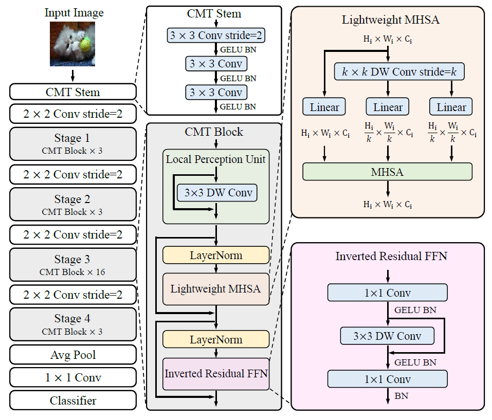 </p>


## Features
- From-scratch implementations of CvT and CMT
- Modular architecture design
- Mixed Precision Training (AMP)
- MixUp + CutMix support
- Checkpoint management
- Early stopping & Configurable schedulers
- Logging utilities
- Attention map visualization

## Project Structure
```text
ConvViTs/
│
├── figs/                         # Saved figures, visualizations, attention maps, dashboards
├── logs/                           # Training logs files
├── checkpoints/                    # Saved checkpoints and model weights
│
├── data/
│   ├── data_loaders/
│   │   ├── __init__.py             # Data loader package initializer
│   │   └── tinyimagenet_loader.py  # Tiny ImageNet dataset loader
│   │
│   ├── __init__.py                 # Data loader factory
│   ├── transforms.py               # Data augmentation and preprocessing pipeline
│   └── mixup_cutmix.py             # MixUp and CutMix augmentation utilities
│
├── data_sources/
│   └── tiny-imagenet-200/          # Tiny ImageNet dataset directory (You have to download it)
│
├── models/
│   ├── cmt/
│   │   ├── __init__.py             # CMT package initializer
│   │   ├── CMT.py                  # Main CMT model definition
│   │   ├── cmt_block.py            # Core CMT block implementation
│   │   ├── cmt_irffn.py            # Inverted Residual Feed Forward Network
│   │   ├── cmt_lmhsa.py            # Lightweight Multi-Head Self Attention
│   │   ├── cmt_lpu.py              # Local Perception Unit
│   │   ├── cmt_stage.py            # CMT stage definition
│   │   ├── cmt_stem.py             # Initial convolutional stem
│   │   └── cmt_patch_embed.py      # Patch embedding module
│   │
│   └── cvt/
│       ├── __init__.py             # CvT package initializer
│       ├── conv_embed.py           # Convolutional token embedding
│       ├── conv_projection.py      # Convolutional Q/K/V projections
│       ├── conv_attention.py       # Convolutional attention module
│       ├── cvt_mlp.py              # Feed-forward MLP block
│       ├── cvt_block.py            # Core CvT transformer block
│       ├── drop_path.py            # Stochastic depth implementation
│       ├── cvt_stage.py            # CvT stage definition
│       └── CvT.py                  # Main CvT model definition
│
├── utils/
│   ├── __init__.py                 # Utilities package initializer
│   ├── decorators.py               # Helper decorators
│   ├── evaluation.py               # Evaluation and metric computation
│   ├── visualization.py            # Visualization and attention map utilities
│   └── logger.py                   # Logging utilities
│
├── __init__.py                     # Project package initializer
├── .gitignore                      # Ignored files and directories
├── parameters.py                   # CLI argument parsing and configuration system
├── train.py                        # Training pipeline
├── test.py                         # Evaluation pipeline
├── main.py                         # Main project entry point
├── README.md                       # Project documentation
└── requirements.txt                # Python dependencies
```

## Setup

### 1. Clone Repository
```bash
git clone https://github.com/odabashi/ConvViTs.git
cd ConvViTs
```


### 2. Create Environment

#### 2.1. Conda

```bash
conda create -n convvits python=3.11
conda activate convvits
```

#### 2.2. Virtual Environment

```bash
python -m venv venv
```

##### 2.2.1. Linux / macOS

```bash
source venv/bin/activate
```

##### 2.2.2. Windows

```bash
venv\Scripts\activate
```


### 3. Install Dependencies

```bash
pip install -r requirements.txt
```


### 4. Prepare Dataset

Download Tiny ImageNet (You can download from this [link](http://cs231n.stanford.edu/tiny-imagenet-200.zip)) and place it under:

```text
data_sources/tiny-imagenet-200/
```


## Usage

### 1. Basic Training

#### 1.1. Train CvT

```bash
python main.py \
    --model-name cvt \
    --mode train \
    --run-name cvt_exp
```

#### 1.2. Train CMT

```bash
python main.py \
    --model-name cmt \
    --cmt-variant ti \
    --mode train \
    --run-name cmt_ti_exp
```

### 2. Common Run Scenarios

#### 2.1. Train + Test

```bash
python main.py \
    --model-name cvt \
    --mode both \
    --epochs 300 \
    --batch-size 128 \
    --run-name cvt_full_run
```

#### 2.2. Test Only

```bash
python main.py \
    --model-name cvt \
    --mode test \
    --resume checkpoints/cvt_exp/best.pt
```


#### 2.3. Resume Training

```bash
python main.py \
    --model-name cmt \
    --mode train \
    --resume checkpoints/cmt_exp/latest.pt \
    --run-name resumed_cmt
```

#### 2.4. Profile Model FLOPs / Parameters

```bash
python main.py \
    --model-name cvt \
    --mode profile
```


#### 2.5. Disable AMP

```bash
python main.py \
    --model-name cvt \
    --no-amp
```


#### 2.6. Train with Step Scheduler

```bash
python main.py \
    --model-name cmt \
    --scheduler step \
    --step-size 30 \
    --gamma 0.1
```


#### 2.7. Custom CvT Configuration

```bash
python main.py \
    --model-name cvt \
    --cvt-embed-dims 64 192 384 \
    --cvt-depths 1 2 10 \
    --cvt-num-heads 1 3 6 \
    --drop-path-rate 0.1
```


#### 2.8. Train CMT Variants

##### 2.8.1. CMT-Ti

```bash
python main.py \
    --model-name cmt \
    --cmt-variant ti
```

##### 2.8.2. CMT-XS

```bash
python main.py \
    --model-name cmt \
    --cmt-variant xs
```


##### 2.8.3. CMT-S

```bash
python main.py \
    --model-name cmt \
    --cmt-variant s
```

##### 2.8.4. CMT-B

```bash
python main.py \
    --model-name cmt \
    --cmt-variant b
```

## Important Arguments

| Argument             | Description                                                     |
|----------------------|-----------------------------------------------------------------|
| `--model-name`       | Model selection (`cvt`, `cmt`)                                  |
| `--mode`             | Execution mode (`train`, `test`, `both`, `profile`)             |
| `--epochs`           | Number of training epochs                                       |
| `--batch-size`       | Training batch size                                             |
| `--learning-rate`    | Initial learning rate                                           |
| `--scheduler`        | LR scheduler (`cosine`, `step`)                                 |
| `--label-smoothing`  | Label Smoothing Factor (default: 0.1)                           |
| `--amp` / `--no-amp` | Enable or disable mixed precision                               |
| `--resume`           | Resume training from checkpoint                                 |
| `--cmt-variant`      | CMT variant (`ti`, `xs`, `s`, `b`)                              |
| `--dataset`          | Dataset selection, currently only `tiny-imagenet-200` available |


## Experiment Results (CvT-13 vs. CMT-XS on Tiny ImageNet)

[//]: # (## 1. Quantitative Results: )

[//]: # (### 1.1. Results on Validation Set)

[//]: # ()
[//]: # (| Model  | Model FLOPs | #Model Params | Loss   | Top-1  | Top-5  | Precision | Recall | F1     | Epoch         | Time Taken |)

[//]: # (|--------|-------------|---------------|--------|--------|--------|-----------|---------|--------|---------------|------------|)

[//]: # (| CvT-13 | 353.66 MMac | 24.36 M       | 2.2429 | 48.70% | 73.20% | 0.4984    | 0.4847 | 0.4763 | 135 &#40;Best: 95&#41; | ⁓6.5h      |)

[//]: # (| CMT-XS | 168.1 MMac  | 13.42 M       | 1.7282 | 61.80% | 80.88% | 0.6168    | 0.617 | 0.6097 | 300 &#40;Best: 299&#41; | ⁓27.66h    |)

## 1. Quantitative Results on Test Set

| Model  | Model FLOPs | #Model Params | Top-1  | Top-5   | Precision | Recall | F1     |
|--------|-------------|---------------|--------|---------|-----------|---------|--------|
| CvT-13 | 353.66 MMac | 24.36 M       | 48.9% (2445/5000) | 73.72%  | 0.5052    | 0.4886 | 0.4795 |
| CMT-XS | 168.1 MMac  | 13.42 M       | 62.6% (3130/5000) | 81.58%  | 0.6268    | 0.6267 | 0.6194 |

## 2. Training Dashboard

### 2.1. CvT-13 on Tiny ImageNet

<p align="center">
  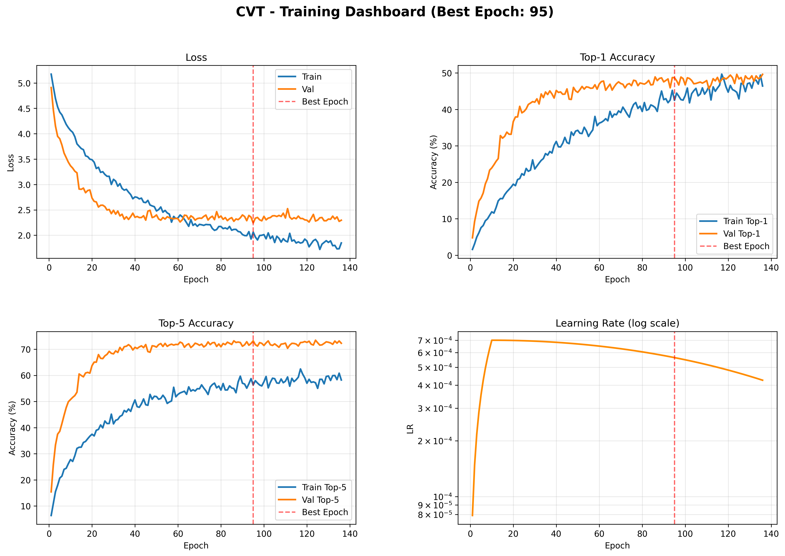
</p>

### 2.2. CMT-XS on Tiny ImageNet

<p align="center">
  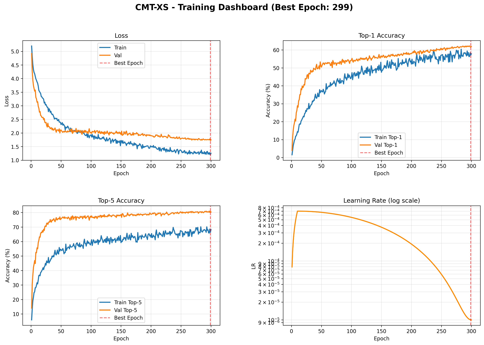
</p>

## 3. Attention Maps

### 3.1. CvT-13 on Tiny ImageNet

Visualization of learned attention patterns from trained models.

<p align="center">
  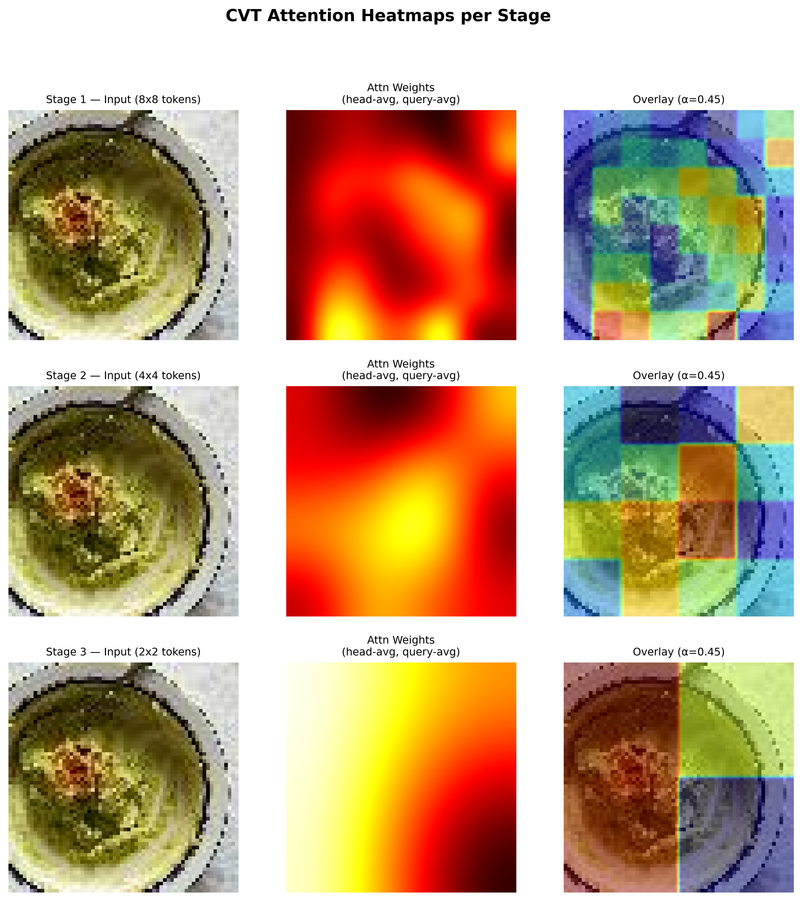
</p>
<p align="center">
  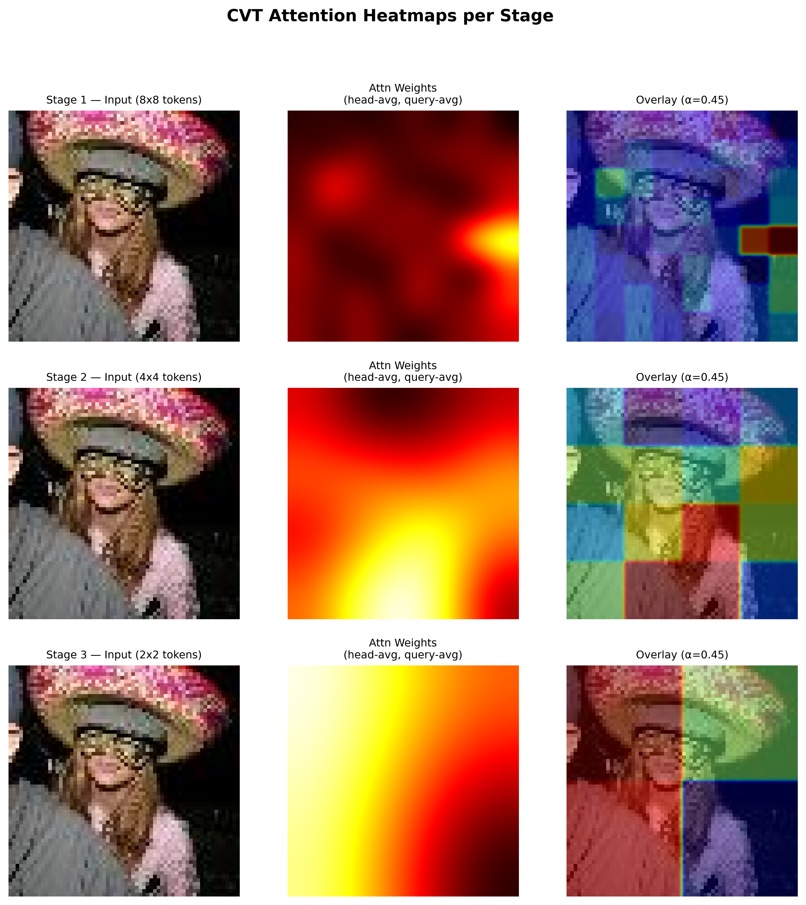
</p>
<p align="center">
  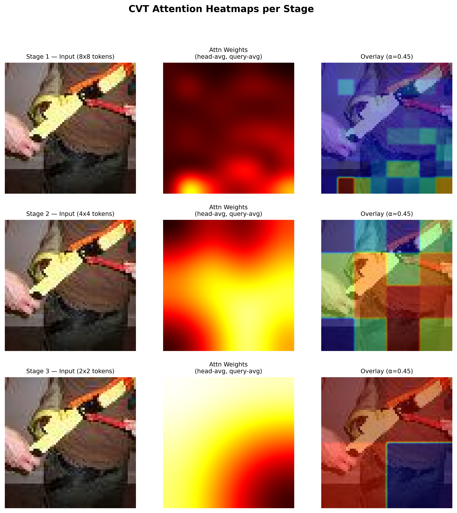
</p>
<p align="center">
  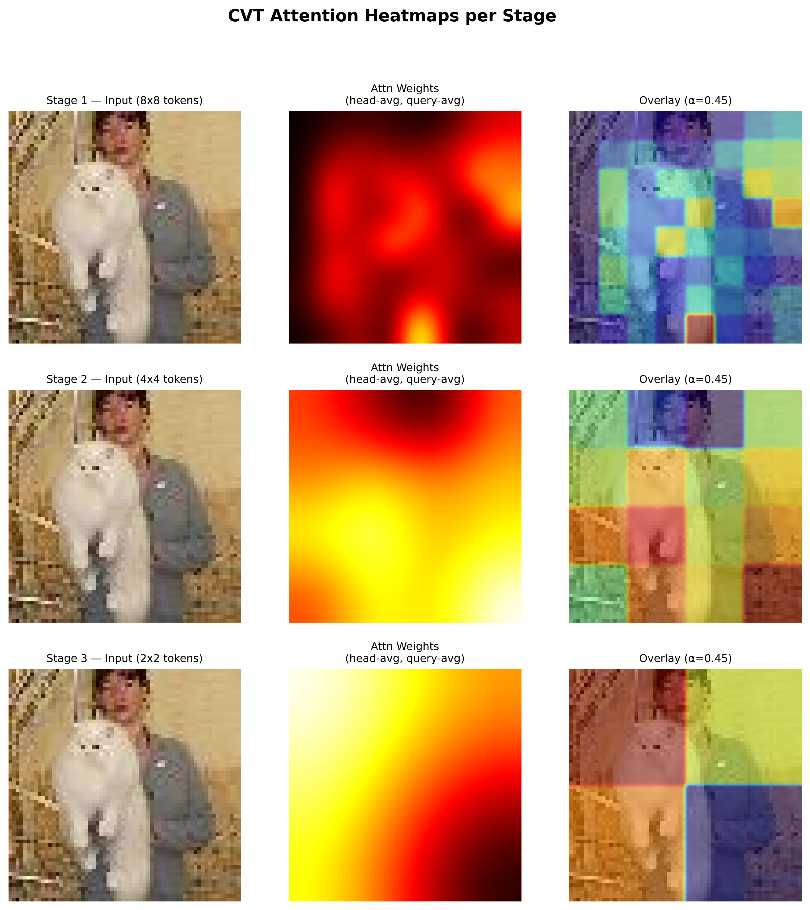
</p>

### 3.2. CMT-XS on Tiny ImageNet

Visualization of learned attention patterns from trained models.

<p align="center">
  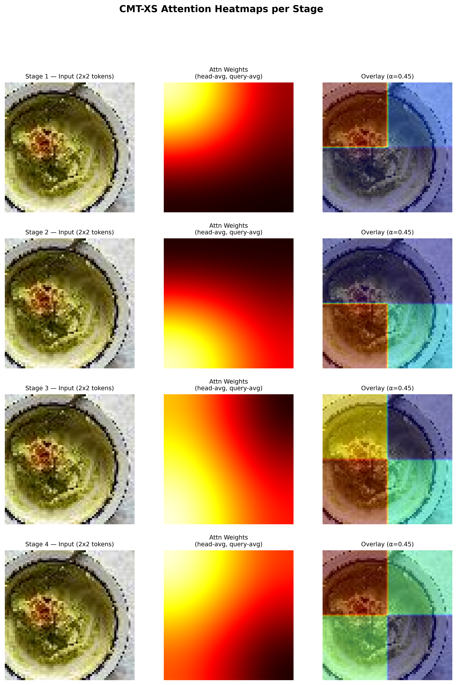
</p>
<p align="center">
  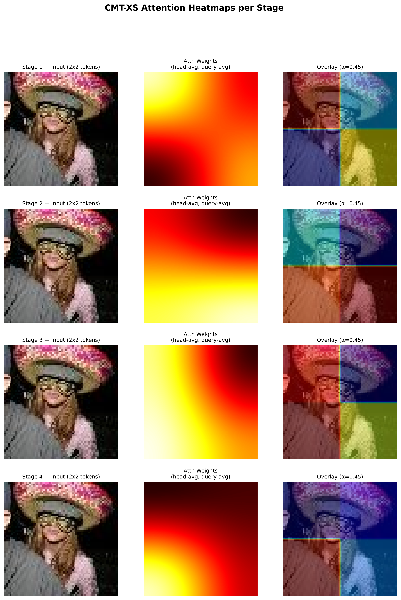
</p>
<p align="center">
  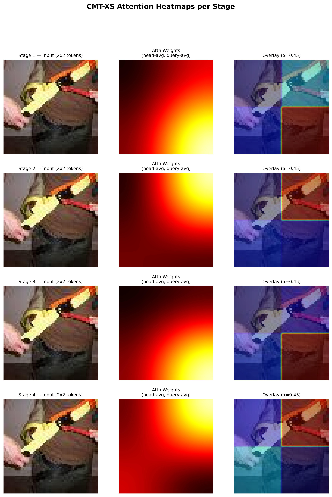
</p>
<p align="center">
  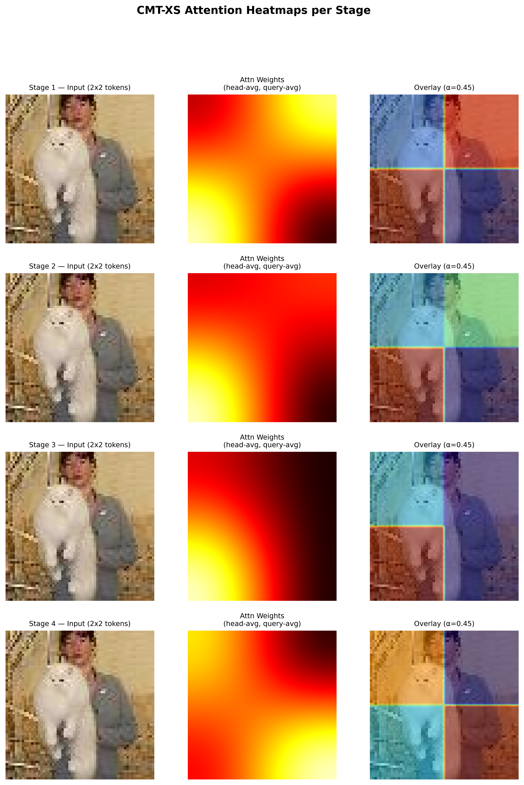
</p>

## 4. Prediction Gallery

Example predictions from trained models.

### 4.1. CvT-13 on Tiny ImageNet

<p align="center">
  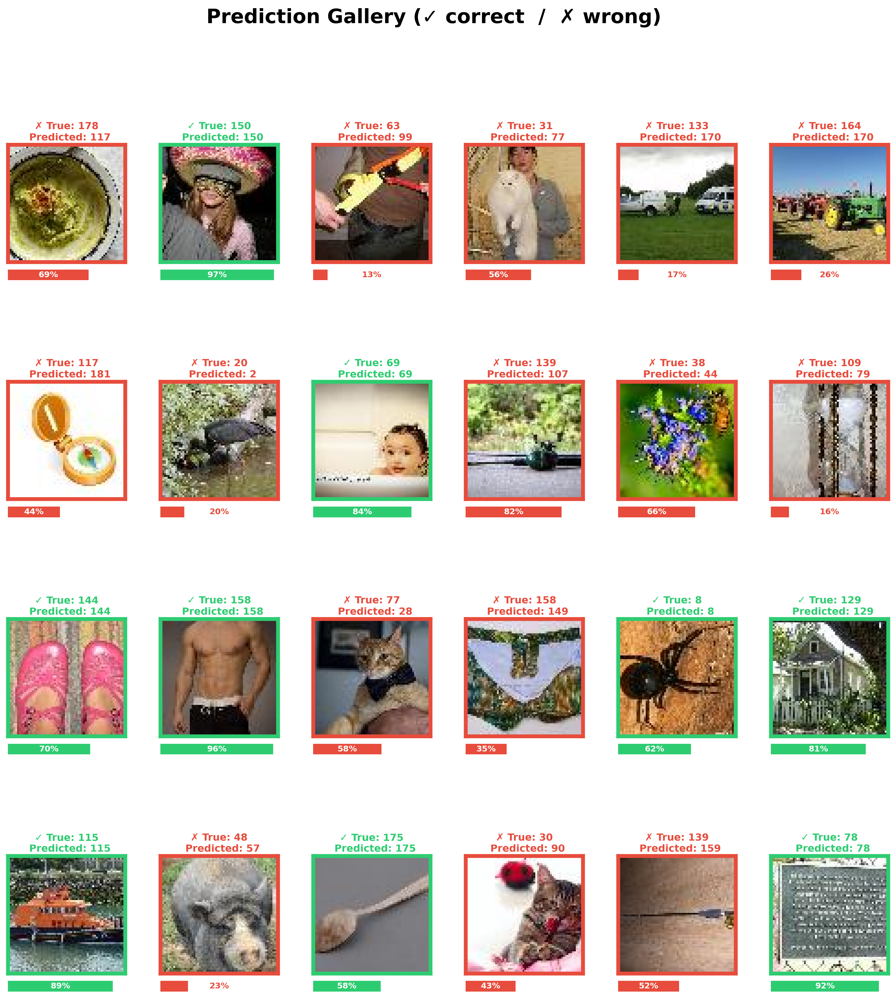
</p>

### 4.2. CMT-XS on Tiny ImageNet

<p align="center">
  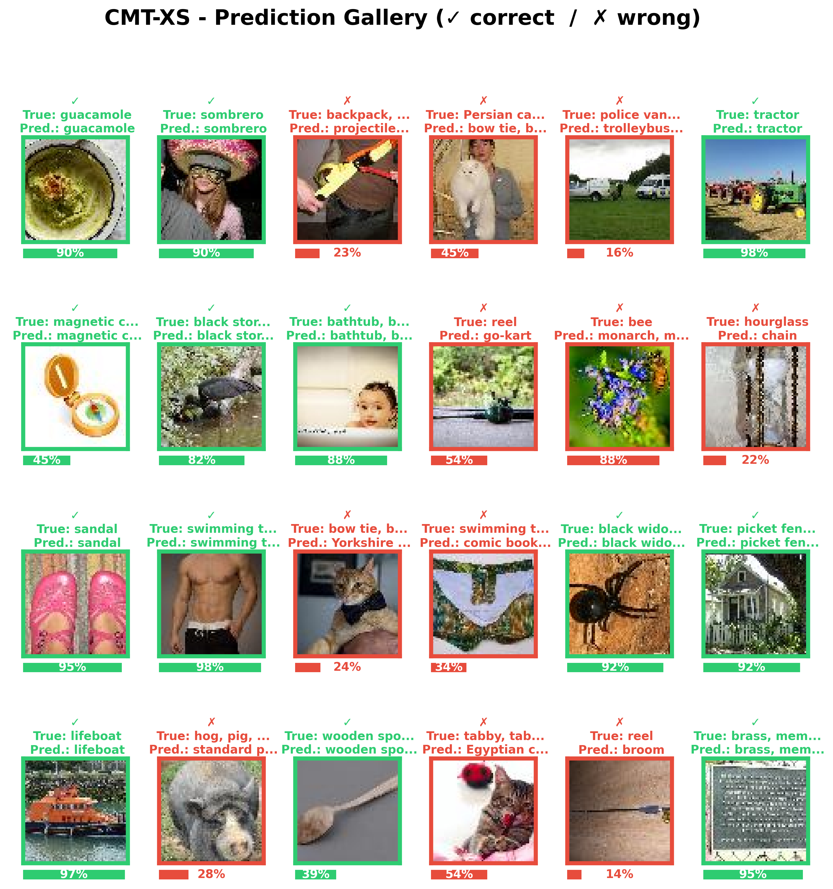
</p>

## Future Improvements

- Support for additional datasets
- More ConvViT architectures
- Hyperparameter sweep integration
- WandB integration
- Distributed multi-GPU training
- ...


## References

### CvT

```bibtex
@InProceedings{cvt2021,
  title = {{CvT}: Introducing Convolutions to Vision Transformers},
  author = {Wu, Haiping and Xiao, Binhui and Codella, Noel and Liu, Mengchen and Dai, Xiyang and Yuan, Lu and Zhang, Lei},
  booktitle = {Proceedings of the IEEE/CVF International Conference on Computer Vision (ICCV)},
  month = {October},
  year = {2021},
  pages = {22-31},
  doi = {10.1109/ICCV48922.2021.00009}
}
```

### CMT

```bibtex
@InProceedings{cmt2022,
  title = {{CMT}: Convolutional Neural Networks Meet Vision Transformers},
  author = {Guo, Jianyuan and Han, Kai and Wu, Han Wu and Tang, Yehui and Chen, Xinghao and Wang, Yunhe and Xu, Chang},
  booktitle = {Proceedings of the IEEE/CVF Conference on Computer Vision and Pattern Recognition (CVPR)},
  month = {June},
  year = {2022},
  pages = {12175-12185},
  doi = {10.1109/CVPR52688.2022.01186},
}
```

## Acknowledgements

Thanks to the authors of CvT and CMT for their excellent research and open contributions to the vision community.
